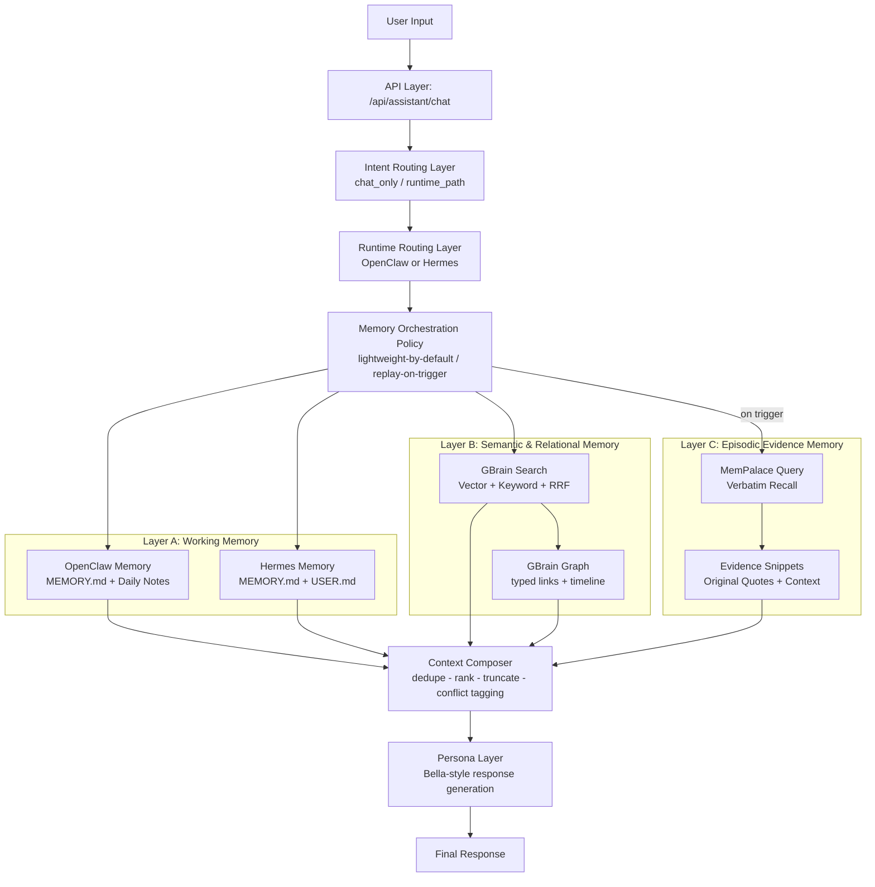

# AI Companion Memory Architecture (Yours)

Chinese version: [`AI 伴侣记忆架构.md`](https://github.com/JCat007/Yours-A-more-thoughtful-AI-companion/blob/main/AI%20Companion%20Memory%20Architecture/AI%20%E4%BC%B4%E4%BE%A3%E8%AE%B0%E5%BF%86%E6%9E%B6%E6%9E%84.md)

## 1. Objective and Scope

This document defines the layered memory architecture for `Yours` in AI companion scenarios, and answers three core questions:

1. What are the responsibility boundaries among OpenClaw/Hermes, GBrain, and MemPalace?
2. Why MemPalace should not be called every turn, and what exact trigger conditions should be used?
3. What behavioral differences users should observe in real conversations?

---

## 2. Terminology (Professional First, Then Example)

### 2.1 Working Memory / Attention (Working Memory)

**Definition**  
Working memory is a high-priority, low-capacity, short-lifetime context set used to control response style, execution constraints, and current-turn intent in real time.  
In `Yours`, this is primarily handled by the built-in memory of OpenClaw/Hermes.

**Typical content**

- Response format preferences (concise / bullet points / tone)
- Current task constraints ("give conclusion only, no expansion")
- Turn-level operation state (whether the task is in continuation mode)

> **Example**  
> User says: "Use only three bullet points today."  
> The next response applies this immediately.  
> This is working memory: small, fast, and instantly behavior-shaping.

### 2.2 Semantic Memory / Relational Network (Semantic + Relational Memory)

**Definition**  
Semantic memory is a cross-session, long-lived knowledge layer that stores entities, facts, relations, and timelines, enabling retrieval and reasoning from isolated facts to connected networks.  
In `Yours`, this layer is provided by GBrain hybrid search + graph query.

**Typical content**

- Entity information about people, companies, projects, topics
- Typed links (e.g., `works_at`, `attended`, `invested_in`)
- Compiled long-term facts and traceable timelines

> **Example**  
> The system knows "Alice works at Acme", "you meet Alice next week", and "Acme is pushing Project A".  
> When you ask for a pre-meeting briefing, it can connect all three automatically.

### 2.3 Episodic Memory / Event Replay (Episodic Verbatim Recall)

**Definition**  
Episodic memory restores the original expression and context of a specific event, prioritizing verbatim evidence over summarized paraphrase.  
In `Yours`, this is handled by MemPalace (verbatim storage + semantic retrieval).

**Typical content**

- Time-anchored conversation excerpts
- High-emotion events (commitment, conflict, repair)
- Historical records requiring quote-level evidence

> **Example**  
> User asks: "Find my exact sentence from last year. Do not summarize."  
> The system should trigger MemPalace and return original snippets, not approximate paraphrases.

---

## 3. Capability Boundary Comparison

| Dimension | OpenClaw Memory | Hermes Memory | GBrain | MemPalace |
|---|---|---|---|---|
| System role | Memory inside OpenClaw runtime | Memory inside Hermes runtime | Long-term semantic + relational hub | Verbatim evidence replay layer |
| Primary storage | `MEMORY.md`, daily notes, optional `DREAMS.md` | `MEMORY.md`, `USER.md`, `state.db` | markdown repo + Postgres/pgvector + graph | wing/room/drawer + vector backend |
| Primary retrieval | `memory_search`, `memory_get` | startup injection + `session_search` | vector + keyword + RRF + graph traversal | semantic search, prioritizing verbatim fidelity |
| Strengths | Tight coupling with OpenClaw execution loop | Stable startup behavior and explicit memory bounds | Cross-entity reasoning and long-term maintenance | Event-level replay and quote-level verification |
| Main limits | Not ideal for deep graph reasoning | Limited hot-memory capacity | Not designed for quote output on every turn | Per-turn calls add latency/noise cost |

> **Summary**  
> OpenClaw/Hermes are like "sticky notes", GBrain is a "knowledge backbone", and MemPalace is an "evidence archive".

---

## 4. Yours Memory Architecture Overview (Detailed Diagram)



> **Summary**  
> By default, only Layer A + B are used (fast path).  
> Layer C is enabled only when specific episodic evidence is needed (precision path).

---

## 5. MemPalace Invocation Strategy (Formal Policy)

### 5.1 Conclusion

MemPalace **should not be called on every turn**. It should follow a conditional trigger policy.

### 5.2 Trigger Conditions (any one is sufficient)

1. **Explicit recall request**: instructions like "remember that time / exact sentence / quote from last year".  
2. **Time anchor + event semantics**: explicit temporal scope combined with event-oriented language.  
3. **Evidence requirement**: user requests original wording instead of a summary.  
4. **Conflict verification**: ambiguous, conflicting, or low-confidence GBrain retrieval.  
5. **High-emotion events**: commitment, repair, and relationship-sensitive moments requiring contextual fidelity.

### 5.3 Non-trigger Conditions (skip only when all are true)

- The query is instant QA or a lightweight task;
- Working memory + GBrain already provide a high-confidence answer;
- No quote-level evidence is requested;
- Episodic replay is unlikely to change correctness.

> **Summary**  
> The policy is not "replay everything", but "replay when evidence is required."

---

## 6. Typical Flows (Formal Steps + Practical Examples)

### 6.1 Flow A: MemPalace Triggered (Anniversary + Emotional Context)

**Process**

1. Read working memory (preferences, expression constraints).  
2. Query GBrain (relations, timeline, historical plans).  
3. Detect quote-level recall requirement and trigger MemPalace.  
4. Extract verbatim snippets and cross-check consistency with GBrain.  
5. Send to Persona layer for final response (facts unchanged, style adaptive).

> **Example input**  
> "My mom's birthday is next week. Do you remember my exact sentence from last year? No summary, quote it."

> **Expected output characteristics**  
> - Quote-level evidence first;  
> - Then actionable planning suggestions (reminder timing, gift options, phrasing);  
> - Bella style preserved without rewriting evidence.

### 6.2 Flow B: MemPalace Not Triggered (Task Recovery)

**Process**

1. Read working memory ("concise, execution-oriented").  
2. Query GBrain (project status, recent blockers, pending tasks).  
3. Determine no quote-level evidence requirement; skip MemPalace.  
4. Generate and return action plan directly.

> **Example input**  
> "I procrastinated again. Help me resume the podcast plan in three steps."

> **Expected output characteristics**  
> - <= 3 actionable steps;  
> - Focus on immediate execution, not historical replay;  
> - Low-latency and low-noise response.

---

## 7. User-Observable Behavior

### 7.1 Why does the assistant sometimes answer with detailed memory, and sometimes with summary?

The system uses two paths:

- **Default path**: working memory + GBrain (efficiency-first)  
- **Replay path**: working memory + GBrain + MemPalace (evidence-first)

> **Practical interpretation**  
> For task execution, it responds quickly.  
> For "what exactly was said back then", it responds with evidence.

### 7.2 Why does it sometimes say "insufficient information"?

If all three layers fail to provide reliable evidence, the system should refuse to guess and explicitly report insufficient information.

---

## 8. Design Principles (Product + Trustworthiness)

- **Evidence-first**: when evidence layer and relational layer conflict, prioritize traceable evidence.  
- **Depth-on-demand**: lightweight retrieval by default; avoid over-recall.  
- **Layered writes**: preferences to working memory, long-term facts to GBrain, quote-grade evidence to MemPalace.  
- **Expression-fact decoupling**: Persona changes style only, never source facts.

---

## 9. One-Sentence Summary

`Yours` should use a three-layer collaborative memory model rather than a single memory store:  
**working memory for immediate response, GBrain for long-term understanding, and MemPalace for episodic replay and quote-level evidence.**

---

## 10. Glossary

| Term | Formal Definition | Where It Lives in Yours |
|---|---|---|
| Working Memory | Low-capacity, high-timeliness context for turn-level control | OpenClaw/Hermes built-in memory (preferences, format, constraints) |
| Semantic Memory | Cross-session stable factual and conceptual knowledge | GBrain retrieval layer (facts, entities, topics) |
| Relational Graph | Traversable structured links among entities | GBrain graph-query (typed links, timeline) |
| Episodic Memory | Time-anchored, context-rich record of specific events | MemPalace verbatim replay |
| Verbatim | Raw text fidelity without paraphrase/summarization | Core MemPalace value for quote-level evidence |
| Hybrid Search | Fusion of vector and keyword retrieval | GBrain default retrieval paradigm (Vector + Keyword + RRF) |
| RRF (Reciprocal Rank Fusion) | Rank-fusion algorithm over multiple retrieval channels | GBrain recall-stability mechanism |
| Triggered Replay | Deep evidence retrieval enabled only on conditions | MemPalace invocation policy (not per turn) |
| Evidence Verification | Original-text confirmation under conflict/uncertainty | GBrain localization + MemPalace verification |
| Persona Layer | Style generation layer over factual context | Bella-style output without changing evidence |

---

## 11. Memory Orchestration Decision Table

### 11.1 Runtime Decision Matrix

| Scenario Signal | Working Memory (OpenClaw/Hermes) | GBrain | MemPalace | Expected Output Shape |
|---|---|---|---|---|
| Lightweight chat / instant QA | Required | Optional (low frequency) | Skip | Fast natural response |
| Explicit task progress (no historical evidence request) | Required | Required | Skip | Action checklist / execution steps |
| Cross-session relation question (people-project-topic) | Required | Required (graph-priority) | Optional | Structured relational answer |
| User asks "quote it / no summary" | Required | Required (localize first) | Required | Evidence snippets + conclusion |
| Time-anchored event recall (last time / last year) | Required | Required | High-priority call | Time-based replay + suggestion |
| Retrieval conflict or low confidence | Required | Required | Required (verification) | Answer with uncertainty-aware framing |
| High-emotion commitment/conflict repair | Required | Required | Recommended | Empathetic response backed by evidence |

### 11.2 MemPalace Trigger Rule (Engineering-Friendly)

```text
IF (
  explicit_recall_request == true
  OR quote_required == true
  OR (has_time_anchor == true AND has_event_semantics == true)
  OR retrieval_conflict == true
  OR gbrain_confidence < threshold
)
THEN call_mempalace = true
ELSE call_mempalace = false
```

Recommended threshold behavior:

- If `gbrain_confidence` is below threshold, trigger MemPalace for evidence replay first;
- If MemPalace still yields no valid hit, return a safe response: "insufficient information + ask for additional cues";
- Under all conditions, Persona must not override evidence conclusions.

