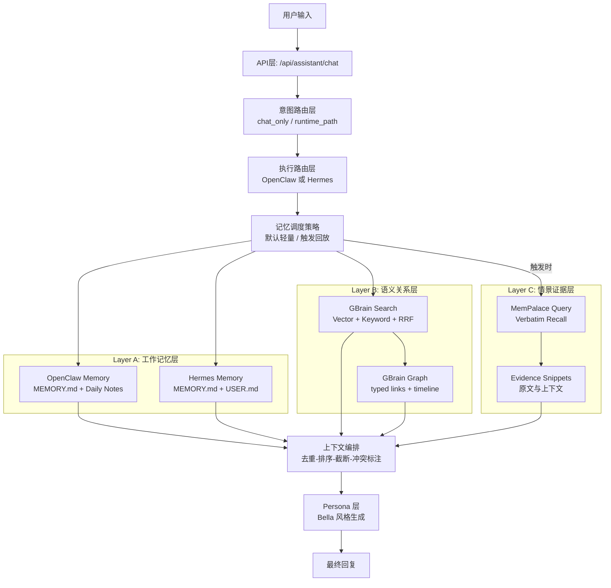

# AI 伴侣记忆架构（Yours）

English version: [`AI Companion Memory Architecture.md`](https://github.com/JCat007/Yours-A-more-thoughtful-AI-companion/blob/main/AI%20Companion%20Memory%20Architecture/AI%20Companion%20Memory%20Architecture.md)

## 1. 文档目标与适用范围

本文定义 `Yours` 在 AI 伴侣场景下的分层记忆架构，回答三个核心问题：

1. OpenClaw/Hermes、GBrain、MemPalace 在系统中的职责边界是什么；
2. 为什么 MemPalace 不应每轮调用，以及它的精确触发条件是什么；
3. 用户在实际对话中会观察到什么行为差异。

---

## 2. 术语定义（先专业，再示例）

### 2.1 工作记忆 / 注意力（Working Memory）

**定义**  
工作记忆是当前回合内高优先级、低容量、强时效的信息集合，主要用于即时控制回复风格、执行约束与本轮任务意图。  
在 `Yours` 中，工作记忆主要由 OpenClaw/Hermes 内置 memory 承担。

**典型内容**

- 回复格式偏好（简短/分点/语气）
- 当前任务约束（“只给结论，不展开”）
- 本轮操作状态（是否处于任务继续态）

> **例子**  
> 用户说“今天请只用三条要点”。下一轮立即生效。  
> 这属于工作记忆：容量小、更新快、立刻影响输出。

### 2.2 语义记忆 / 关系网络（Semantic + Relational Memory）

**定义**  
语义记忆是跨会话长期稳定的知识层，存储实体、事实、关系与时间线，支持“由点到网”的检索和推理。  
在 `Yours` 中，该层由 GBrain 的 hybrid search + graph query 提供。

**典型内容**

- 人物、公司、项目、主题的实体信息
- typed links（例如 works_at、attended、invested_in）
- 编译后的长期事实与可追踪时间线

> **例子**  
> 系统知道“张三在 Acme”“你下周与张三会面”“Acme 正在推进 A 项目”。  
> 当你问“给我下周会前 briefing”，系统能自动把这三类信息连起来。

### 2.3 情景记忆 / 事件回放（Episodic Verbatim Recall）

**定义**  
情景记忆用于恢复某次具体事件的原始表达与语境，强调“原文证据”而非摘要重述。  
在 `Yours` 中，该层由 MemPalace 承担（verbatim 存储 + 语义召回）。

**典型内容**

- 具体时间点发生的对话片段
- 高情绪强度场景（承诺、冲突、修复）
- 需要“原话举证”的历史记录

> **例子**  
> 用户问：“把我去年那句原话找出来，不要概括。”  
> 系统应触发 MemPalace，返回原文片段，而不是“你大概是这个意思”。

---

## 3. 四者能力边界对比

| 维度 | OpenClaw Memory | Hermes Memory | GBrain | MemPalace |
|---|---|---|---|---|
| 系统定位 | OpenClaw 执行框架内记忆 | Hermes 执行框架内记忆 | 长期语义与关系中枢 | 原文证据回放层 |
| 主要存储 | `MEMORY.md`、日记文件、可选 `DREAMS.md` | `MEMORY.md`、`USER.md`、`state.db` | markdown repo + Postgres/pgvector + graph | wing/room/drawer + 向量后端 |
| 主要检索 | `memory_search`、`memory_get` | 启动注入 + `session_search` | vector + keyword + RRF + graph traversal | 语义检索，优先原文保真 |
| 强项 | 与 OpenClaw 执行链强耦合 | 启动稳定、容量边界清晰 | 跨实体关系理解、长期维护 | 具体事件回放、原文核验 |
| 主要限制 | 不擅长深关系图谱推理 | 热记忆容量受限 | 不是“每次都给原话”的系统 | 每轮调用会引入额外成本 |

> **总结**  
> OpenClaw/Hermes 更像“随身便签”，GBrain 像“知识中台”，MemPalace 像“录像档案”。

---

## 4. Yours 记忆架构总览（详细架构图）



> **总结**  
> 默认只走 A+B 两层（快）。  
> 只有“要回忆具体往事”时才打开 C 层（准）。

---

## 5. MemPalace 调用策略（专业判定）

### 5.1 结论

MemPalace **不应每轮调用**，应采用“条件触发式调用”。

### 5.2 触发条件（任一满足即可）

1. **显式回忆请求**：包含“还记得那次/去年那句/原话”等指令。  
2. **时间锚点 + 事件语义**：存在明确时间区间与事件词。  
3. **证据要求**：用户要求“不要总结，只给原文”。  
4. **冲突核验**：GBrain 检索结果出现歧义、冲突或置信不足。  
5. **高情绪事件**：承诺、冲突修复、关系节点等对语境敏感场景。

### 5.3 不触发条件（全部满足时跳过）

- 当前问题为即时问答或轻任务；
- 工作记忆 + GBrain 已给出高置信答案；
- 用户未提出原文级证据需求；
- 回放结果预计不会影响答案正确性。

> **总结**  
> 不是“每句都翻旧账”，而是“需要举证时才翻档案”。

---

## 6. 典型流程（专业步骤 + 引用示例）

### 6.1 流程 A：触发 MemPalace（纪念日与情绪语境）

**流程步骤**

1. 读取工作记忆（用户偏好、表达约束）。  
2. 查询 GBrain（人物关系、时间线、历史计划）。  
3. 识别“原话级回忆需求”，触发 MemPalace。  
4. 抽取原文片段并与 GBrain 结果做一致性校验。  
5. 交由 Persona 层输出最终回复（事实不变，风格可调）。

> **示例输入**  
> “下周我妈生日，你还记得我去年最在意的那句话吗？别概括，给原话。”

> **示例输出特征**  
> - 先给出原话证据；  
> - 再给出今年可执行建议（提醒时间点、礼物方案、表达模板）；  
> - 语气保持 Bella 风格，但不改写证据本身。

### 6.2 流程 B：不触发 MemPalace（任务恢复）

**流程步骤**

1. 读取工作记忆（“简短、执行导向”）。  
2. 查询 GBrain（项目状态、最近阻塞点、待办）。  
3. 判定无原文举证需求，不触发 MemPalace。  
4. 直接生成行动计划并返回。

> **示例输入**  
> “我今天又拖延了，帮我恢复播客计划，三步就好。”

> **示例输出特征**  
> - 3 步以内行动清单；  
> - 聚焦当下执行，不做历史细节回放；  
> - 低延迟、低噪音。

---

## 7. 用户可感知行为说明

### 7.1 为什么有时“记得很细”，有时“只给总结”

系统采用双路径：

- **默认路径**：工作记忆 + GBrain（效率优先）；  
- **回放路径**：工作记忆 + GBrain + MemPalace（证据优先）。

> **通俗理解**  
> 想快速推进任务时，她会“直接办事”；  
> 你要核对“那次到底怎么说的”时，她会“拿证据说话”。

### 7.2 为什么有时会说“信息不足”

当三层记忆都无法提供可靠证据时，系统应拒绝猜测并显式告知信息不足。

---

## 8. 设计原则（面向产品与可信度）

- **事实优先**：证据层与关系层冲突时，优先可追溯证据。  
- **按需深挖**：默认轻量检索，避免过度回忆。  
- **分层写入**：偏好写入工作记忆，长期事实写入 GBrain，原文证据由 MemPalace 承担。  
- **表达与事实解耦**：Persona 只改表达，不改事实来源。  

---

## 9. 一句话总结

`Yours` 的理想记忆机制不是单一记忆库，而是三层协同：  
**工作记忆负责即时反应，GBrain 负责长期理解，MemPalace 负责事件回放与原文举证。**

---

## 10. 术语索引（Glossary）

| 术语 | 专业定义 | 在 Yours 中的落点 |
|---|---|---|
| 工作记忆（Working Memory） | 低容量、高时效、用于当前回合控制的上下文集合 | OpenClaw/Hermes 内置 memory（偏好、格式、执行约束） |
| 语义记忆（Semantic Memory） | 跨会话稳定事实与概念知识 | GBrain 检索层（事实、实体、主题） |
| 关系网络（Relational Graph） | 实体之间可遍历的结构化关系图 | GBrain graph-query（typed links、时间线） |
| 情景记忆（Episodic Memory） | 具体事件的时间化、语境化记录 | MemPalace verbatim 原文回放 |
| Verbatim | 不改写、不摘要的原始文本保真存储方式 | MemPalace 的核心价值（原话举证） |
| Hybrid Search | 向量检索与关键词检索的融合检索策略 | GBrain 的默认检索范式（Vector + Keyword + RRF） |
| RRF（Reciprocal Rank Fusion） | 多路检索结果的倒数排名融合算法 | GBrain 用于提升召回稳定性 |
| 触发式回放 | 仅在满足条件时启动深层证据检索 | MemPalace 调用策略（非每轮调用） |
| 证据核验 | 当检索结果冲突或不确定时进行原文确认 | GBrain 定位 + MemPalace 证据确认 |
| Persona 层 | 对事实进行风格化表达的生成层 | Bella 风格输出（不改事实来源） |

---

## 11. 记忆调度决策表（Decision Table）

### 11.1 运行时决策矩阵

| 场景信号 | 工作记忆（OpenClaw/Hermes） | GBrain | MemPalace | 预期输出形态 |
|---|---|---|---|---|
| 轻量闲聊、即时问答 | 必须 | 可选（低频） | 不调用 | 快速自然回复 |
| 明确任务推进（无历史举证） | 必须 | 必须 | 不调用 | 行动清单/执行步骤 |
| 跨会话关系问题（人-事-项目） | 必须 | 必须（graph 优先） | 可选 | 结构化关系结论 |
| 用户要求“给原话/别概括” | 必须 | 必须（先定位） | 必须 | 证据片段 + 结论 |
| 时间锚点事件回忆（去年/上次） | 必须 | 必须 | 高优先级调用 | 时间化回放 + 建议 |
| 检索冲突或置信不足 | 必须 | 必须 | 必须（核验） | 标注不确定性后的答复 |
| 高情绪承诺/冲突修复 | 必须 | 必须 | 建议调用 | 证据支持的共情回复 |

### 11.2 MemPalace 触发判定（工程可落地版本）

```text
IF (
  explicit_recall_request == true
  OR quote_required == true
  OR (has_time_anchor == true AND has_event_semantics == true)
  OR retrieval_conflict == true
  OR gbrain_confidence < threshold
)
THEN call_mempalace = true
ELSE call_mempalace = false
```

建议阈值策略：

- `gbrain_confidence` 低于阈值时，优先触发 MemPalace 进行证据回放；
- 若 MemPalace 仍无有效命中，返回“信息不足 + 需要补充线索”的安全答复；
- 任何情况下，Persona 层不得覆盖证据结论。
