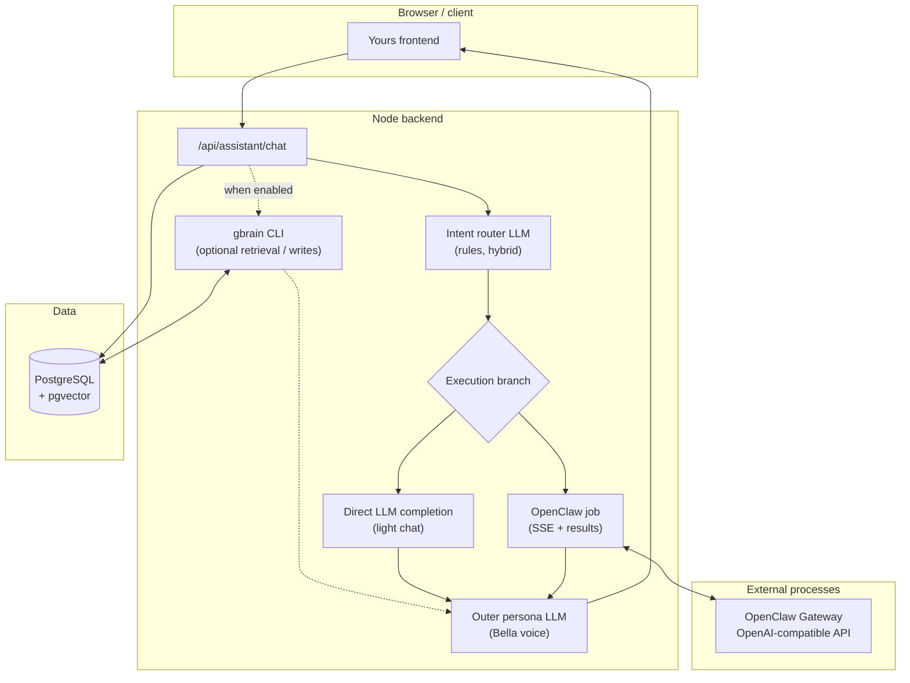

# Yours

Chinese documentation is available in [`READMEcn.md`](READMEcn.md) at the repository root.

## Everlasting and Yours

**Everlasting** is an experiment in helping people achieve a form of digital persistence in an AI-native world. The long-term vision is to combine video, images, voice, and memory-oriented data so digital beings can feel emotion, carry personality and hobbies, and keep growing over time. Through Everlasting, people can meaningfully bring back those who are gone and the scenes that matter, so precious moments can live on in a digital world.

**Yours** is the first-phase product of Everlasting. She is an AI companion designed to grow with you and stay attuned to you (today, only the **Bella** persona is available). Because the project is in its first public release, the codebase prioritizes **functional reliability**; product experience and visual design will continue to improve. A detailed roadmap and milestone plan will be published over time.

---

## Architecture overview

Yours is a **monorepo**: a **React + Vite** frontend, a **Node** backend, **PostgreSQL** by default (with **pgvector** when companion memory is enabled), and an optional **OpenClaw** gateway for tool-heavy work. The conversation pipeline is organized as **intent first**, **execution in the middle**, and **persona last**—not as a single flat LLM call.

### Layers and responsibilities

| Layer | Role | Typical code locations |
|-------|------|------------------------|
| **Intent (router) LLM** | Classifies each turn as casual chat, image-oriented, task-oriented, and so on; decides whether to use OpenClaw. Supports LLM-only, rules-only, or **hybrid** (fall back to rules when the LLM is low-confidence). Uploads force the task path and OpenClaw. | `bellaIntentClassifier.ts`, routing inside `assistant.ts` |
| **Execution layer** | Light `chat_only` paths can use a **synchronous** direct model call for lower latency. Files, images, video, or multi-step work starts an **OpenClaw job** (SSE progress and polled results). Communicates with the gateway over an **OpenAI-compatible** HTTP API. | `assistant.ts`, `routes/assistant.ts` |
| **Outer (persona) LLM** | Does **not** surface raw execution logs to the user. Rewrites execution output in Bella’s voice while preserving facts, and handles failures gently. System persona and SOUL body jointly constrain tone. | `bellaComposer.ts`, `bellaOuterLlm.ts`, `bellaPersona.ts` |
| **OpenClaw** | Optional **executor**, not vendored in this repository. After the router dispatches work to the gateway, agents, tools, and **skills** (documents, media, web extraction, and more) carry it out. Configure via gateway URL, token, agent id, and related environment variables. | External CLI and gateway; see `docs/OPENCLAW_*.md` |
| **gbrain and Postgres** | **Optional long-term companion memory**. Shares **`DATABASE_URL`** with Bella; when enabled, the backend invokes the **gbrain** CLI for retrieval and writes. Retrieved snippets are injected as generation context (OpenClaw paths also receive **write-scope** hints to avoid cross-user leakage). This is a **memory subsystem**; it does not replace the intent or persona LLMs. | `gbrainCli.ts`, `companionChatBridge.ts`, `docs/COMPANION_AUTH_GBRAIN.md` |

**Session state** (short-term context, previous-turn intent, and related fields) is maintained in `bellaState.ts`, independently of gbrain’s longer-horizon storage.

### End-to-end chat flow (`POST /api/assistant/chat`)

1. Accept the message, history, uploads, and mode.  
2. Load short-term session memory.  
3. Run routing to obtain `intent`, `confidence`, and `shouldUseOpenClaw`.  
4. Branch: synchronous text generation, or an OpenClaw job (including downloads and media where applicable).  
5. If companion memory is enabled, merge **gbrain** retrieval into the context used for this turn’s generation.  
6. Invoke the **outer persona LLM** to produce the final user-visible reply.  
7. Return `reply`, `imageUrl`, `videoUrl`, and `downloads`; asynchronous job flows may also return `jobId`.

### Diagram



For deeper implementation notes, see [`docs/ARCHITECTURE_AND_REFACTOR.md`](docs/ARCHITECTURE_AND_REFACTOR.md).

---

## Quick install

**Prerequisites:** Node.js and npm, Docker (default local database), Git.

1. **Clone** this repository and open a terminal at the repository root.

2. **Install dependencies** (once per clone):

   ```bash
   cd backend && npm install
   cd ../frontend && npm install
   ```

3. **Backend environment**

   ```bash
   cp backend/.env.example backend/.env
   ```

   Set at least **`POSTGRES_PASSWORD`** to a long random secret. Unless you use an external database, you can **omit** **`DATABASE_URL`**; the application will build the connection string from `POSTGRES_*`.

4. **Database (Docker, from repository root)**

   ```bash
   npm run docker:db
   ```

5. **Prisma (from `backend/`, before your first serious run)**

   ```bash
   cd backend
   npm run prisma:deploy
   npx prisma generate
   ```

6. **Frontend environment (optional)**  
   Write the `VITE_*` variables you need into `frontend/.env` or `frontend/.env.local` (names are listed in the repository root `.env.example`).

If you plan to use **gbrain**, **do not** rely on the stock `postgres:16` image without vector support; you need **pgvector** (this repository’s Compose file uses a pgvector-capable image). Details: [`docs/COMPANION_AUTH_GBRAIN.md`](docs/COMPANION_AUTH_GBRAIN.md).

---

## Getting started

1. **Start Postgres** (if it is not already running): from the repository root, run `npm run docker:db`.

2. **Backend** (terminal A):

   ```bash
   cd backend
   npm run dev
   ```

   Open **http://localhost:3001/health** in a browser; you should see JSON including `"status":"ok"`.

3. **Frontend** (terminal B):

   ```bash
   cd frontend
   npm run dev
   ```

   Open **http://localhost:5173** for the Bella UI.

4. **First account**  
   When the user table is empty, you can register the first account. If users already exist and you still need another signup, set **`BELLA_ALLOW_REGISTER=1`** in `backend/.env` (see the companion memory documentation).

5. **Optional: OpenClaw and MiniMax (example stack)**  
   Follow [`docs/HANDS_ON_GUIDE.md`](docs/HANDS_ON_GUIDE.md) to configure SOUL, the gateway, and API keys.

6. **Optional: gbrain companion memory**  
   After Postgres and Prisma are in place, run `gbrain init` against the same database, set **`GBRAIN_ENABLED=1`**, and restart the backend. Full steps: [`docs/COMPANION_AUTH_GBRAIN.md`](docs/COMPANION_AUTH_GBRAIN.md).

**Windows with WSL one-click development:** `scripts/dev-start.bat` can start the gateway, backend, frontend, and optional Star Office when the corresponding directories exist. If auto-detection fails, copy `scripts/dev-wsl.config.example.bat` to `scripts/dev-wsl.config.bat` and adjust parameters. You must still run Prisma migrate and generate yourself before relying on database-backed features.

**Production build** (repository root):

```bash
npm run build
```

This runs the backend `tsc` step, then the frontend `tsc && vite build`. You can also run `npm run build:backend` or `npm run build:frontend` separately.

---

## Documentation index

The following documents are intended for publication alongside the GitHub repository. The tables list **file names** and **what each document covers**.

### Core setup and operations

| Document | Contents |
|----------|----------|
| [`docs/LOCAL_SETUP.md`](docs/LOCAL_SETUP.md) | Minimal local run: only `POSTGRES_PASSWORD`, Docker database, Prisma, and dev servers. |
| [`docs/COMPANION_AUTH_GBRAIN.md`](docs/COMPANION_AUTH_GBRAIN.md) | Self-hosted stack: Postgres and pgvector, Bun, gbrain initialization, environment variables, Prisma, login, companion memory toggles, operational password reset. |
| [`docs/ENVIRONMENT_SETUP.md`](docs/ENVIRONMENT_SETUP.md) | Environment file conventions, repository root versus `VITE_*`, cloud secrets, CI guidance. |
| [`NODE_AND_LOCALHOST.md`](NODE_AND_LOCALHOST.md) | Node sanity checks and troubleshooting localhost and port access. |
| [`docs/WSL_MIGRATION.md`](docs/WSL_MIGRATION.md) | Guidance for working under WSL. |
| [`docs/GITHUB_RELEASE_CHECKLIST.md`](docs/GITHUB_RELEASE_CHECKLIST.md) | Pre-public release checklist. |

### Architecture and product behavior

| Document | Contents |
|----------|----------|
| [`docs/ARCHITECTURE_AND_REFACTOR.md`](docs/ARCHITECTURE_AND_REFACTOR.md) | Current Bella stack: routing, execution, persona; request paths; module map; future refactor ideas. |
| [`docs/OPENCLAW_DECISION_FLOW.md`](docs/OPENCLAW_DECISION_FLOW.md) | OpenClaw output shapes, skills mapping, URL routing versus the main intent classifier, SOUL and gateway notes. |
| [`docs/BELLA_CAPABILITIES_AND_SKILLS.md`](docs/BELLA_CAPABILITIES_AND_SKILLS.md) | Bella capabilities and skills surface (overview). |
| [`docs/templates/Bella-SOUL.md`](docs/templates/Bella-SOUL.md) | OpenClaw workspace SOUL template (copy to `~/.openclaw/workspace/SOUL.md`). |

### OpenClaw gateway and skills

| Document | Contents |
|----------|----------|
| [`docs/OPENCLAW_SETUP.md`](docs/OPENCLAW_SETUP.md) | Backend integration with the OpenClaw gateway, HTTP settings, and `backend/.env` wiring. |
| [`docs/OPENCLAW_SKILLS_SETUP.md`](docs/OPENCLAW_SKILLS_SETUP.md) | Skills index and cross-skill setup entry points. |
| [`docs/OPENCLAW_CHINA_WORLD_MODE.md`](docs/OPENCLAW_CHINA_WORLD_MODE.md) | China-region versus world-region behavior for OpenClaw-related flows. |
| [`docs/SKILL_CONVENTION_CHINA_WORLD.md`](docs/SKILL_CONVENTION_CHINA_WORLD.md) | Conventions for authoring skills that differ by region. |
| [`docs/OPENCLAW_PYTHON_VENV_UNIFIED.md`](docs/OPENCLAW_PYTHON_VENV_UNIFIED.md) | Unified Python virtual environment layout for skills. |
| [`docs/OPENCLAW_SANDBOX_UPGRADE.md`](docs/OPENCLAW_SANDBOX_UPGRADE.md) | OpenClaw sandbox upgrade notes. |
| [`docs/OPENCLAW_WEB_FETCH_SSRF_AND_DNS.md`](docs/OPENCLAW_WEB_FETCH_SSRF_AND_DNS.md) | Web fetch safety: SSRF and DNS considerations. |
| [`docs/WEATHER_SKILL_DIAGNOSTIC.md`](docs/WEATHER_SKILL_DIAGNOSTIC.md) | Weather skill troubleshooting. |

**Per-skill setup guides**

| Document | Contents |
|----------|----------|
| [`docs/OPENCLAW_SKILL_PDF_SETUP.md`](docs/OPENCLAW_SKILL_PDF_SETUP.md) | PDF skill. |
| [`docs/OPENCLAW_SKILL_DOCX_SETUP.md`](docs/OPENCLAW_SKILL_DOCX_SETUP.md) | Word and DOCX skill. |
| [`docs/OPENCLAW_SKILL_PPTX_SETUP.md`](docs/OPENCLAW_SKILL_PPTX_SETUP.md) | PowerPoint skill. |
| [`docs/OPENCLAW_SKILL_XLSX_SETUP.md`](docs/OPENCLAW_SKILL_XLSX_SETUP.md) | Excel skill. |
| [`docs/OPENCLAW_SKILL_CANVAS_DESIGN_SETUP.md`](docs/OPENCLAW_SKILL_CANVAS_DESIGN_SETUP.md) | Canvas and visual design skill. |
| [`docs/OPENCLAW_SKILL_FRONTEND_DESIGN_SETUP.md`](docs/OPENCLAW_SKILL_FRONTEND_DESIGN_SETUP.md) | Frontend and landing-page style skills. |
| [`docs/OPENCLAW_SKILL_MEDIA_IMAGE_SETUP.md`](docs/OPENCLAW_SKILL_MEDIA_IMAGE_SETUP.md) | Image generation skill. |
| [`docs/OPENCLAW_SKILL_MEDIA_VIDEO_SETUP.md`](docs/OPENCLAW_SKILL_MEDIA_VIDEO_SETUP.md) | Video generation skill. |
| [`docs/OPENCLAW_SKILL_WEB_TO_MARKDOWN_SETUP.md`](docs/OPENCLAW_SKILL_WEB_TO_MARKDOWN_SETUP.md) | Web-to-Markdown skill. |
| [`docs/OPENCLAW_SKILL_MARKITDOWN_SETUP.md`](docs/OPENCLAW_SKILL_MARKITDOWN_SETUP.md) | MarkItDown base installation. |
| [`docs/OPENCLAW_SKILL_MARKITDOWN_INGEST_SETUP.md`](docs/OPENCLAW_SKILL_MARKITDOWN_INGEST_SETUP.md) | MarkItDown ingest path. |
| [`docs/OPENCLAW_SKILL_MARKITDOWN_MULTIMODAL_SETUP.md`](docs/OPENCLAW_SKILL_MARKITDOWN_MULTIMODAL_SETUP.md) | MarkItDown multimodal installation. |
| [`docs/OPENCLAW_SKILL_TAOBAO_SHOP_PRICE_SETUP.md`](docs/OPENCLAW_SKILL_TAOBAO_SHOP_PRICE_SETUP.md) | Taobao shop price comparison skill. |
| [`docs/OPENCLAW_SKILL_CHINA_E_COMMERCE_PRICE_COMPARISON_SKILLS_SETUP.md`](docs/OPENCLAW_SKILL_CHINA_E_COMMERCE_PRICE_COMPARISON_SKILLS_SETUP.md) | China e-commerce price comparison skills. |

### Providers, deployment, and extensions

| Document | Contents |
|----------|----------|
| [`docs/BELLA_MINIMAX_SETUP.md`](docs/BELLA_MINIMAX_SETUP.md) | MiniMax provider configuration for Bella and the OpenClaw side. |
| [`docs/HANDS_ON_GUIDE.md`](docs/HANDS_ON_GUIDE.md) | Hands-on checklist: MiniMax keys, SOUL, OpenClaw JSON, gateway, curl self-tests. |
| [`docs/DEPLOY_AWS.md`](docs/DEPLOY_AWS.md) | AWS EC2, systemd, and OpenClaw-gateway-style deployment. |
| [`docs/AWS_APP_RUNNER_DEPLOY_BELLA.md`](docs/AWS_APP_RUNNER_DEPLOY_BELLA.md) | AWS App Runner oriented deployment. |
| [`deploy/PUBLIC_DEPLOY.md`](deploy/PUBLIC_DEPLOY.md) | Recommended public topology: gateway on loopback only, backend behind TLS, static frontend hosting. |
| [`docs/STAR_OFFICE_DEPLOY_AND_INTEGRATION.md`](docs/STAR_OFFICE_DEPLOY_AND_INTEGRATION.md) | Star Office submodule deployment and integration. |
| [`docs/OPTIONAL_SUBMODULES.md`](docs/OPTIONAL_SUBMODULES.md) | Optional submodule pattern (environment flags, routes, frontend toggles). |

### Templates

| Document | Contents |
|----------|----------|
| [`docs/templates/skill-china-world-example.md`](docs/templates/skill-china-world-example.md) | Example skill documentation for China versus world split. |

---

## Main entry files (contributors)

- `backend/src/routes/assistant.ts` — orchestration, jobs, SSE, downloads, and media.  
- `backend/src/services/bellaIntentClassifier.ts` — intent classification.  
- `backend/src/services/assistant.ts` — model providers, OpenClaw, media helpers, gbrain context hooks.  
- `backend/src/services/bellaComposer.ts` — final reply assembly.  
- `backend/src/services/bellaOuterLlm.ts` — outer persona LLM.  
- `backend/src/services/bellaPersona.ts` — Bella system prompt.  
- `backend/src/services/bellaState.ts` — session and intent memory.

---

## OpenClaw environment variables

The gateway is not shipped in this repository; install and configure it separately. Common backend variables: **`OPENCLAW_GATEWAY_URL`**, **`OPENCLAW_GATEWAY_TOKEN`** (or compatible names), **`OPENCLAW_AGENT_ID`**.
