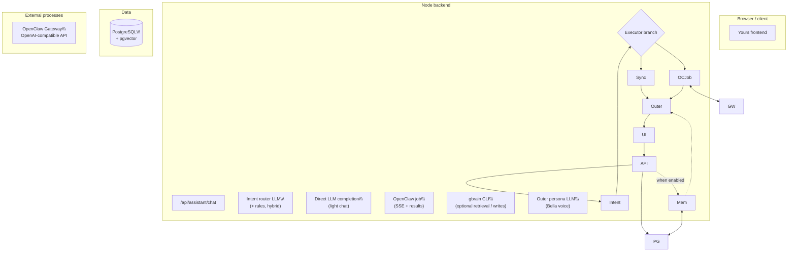

# Yours

## Everlasting and Yours

**Everlasting** is an effort to give people a form of digital persistence in an AI-native world. The long-term vision is to combine video, images, voice, and (memory) data so digital beings can feel, carry personality and hobbies, and keep growing over time. Through Everlasting, people can meaningfully bring back those who are gone and the scenes that matter, so precious moments can live on in a cyber world.

**Yours** is the first-phase product of Everlasting. She is an AI companion designed to grow with you and stay attuned to you (today, only the **Bella** persona is available). Because this is an initial public release, the codebase prioritizes **functional completeness**; product polish and visual design will keep improving. A detailed roadmap and milestone plan will be published over time.

\---

## Architecture

Yours is a monorepo: **React + Vite** frontend, **Node** backend, **PostgreSQL** (with **pgvector** when you enable companion memory), and an optional **OpenClaw** gateway for tool-heavy work. Chat is handled as **intent first**, **execution second**, **persona last**, not as a single flat LLM call.

### Layers and responsibilities

|Layer|Role|Typical code|
|-|-|-|
|**Intent (router) LLM**|Classifies each turn as casual chat, image-oriented, or task-oriented; decides whether OpenClaw should run. Can use LLM only, rules only, or **hybrid** (LLM with rule fallback). Uploads force the task path and OpenClaw.|`bellaIntentClassifier.ts`, routing inside `assistant.ts`|
|**Executor**|Serves light `chat\\\_only` turns **synchronously** for lower latency. For files, images, video, or multi-step work, starts an **OpenClaw job** (SSE progress + polling). Talks to the gateway over an **OpenAI-compatible** HTTP API.|`assistant.ts`, `routes/assistant.ts`|
|**Outer (persona) LLM**|Does **not** show raw executor logs to the user. Rewrites execution output into Bella’s voice, keeps facts, and softens failures. System persona + SOUL body drive tone.|`bellaComposer.ts`, `bellaOuterLlm.ts`, `bellaPersona.ts`|
|**OpenClaw**|Optional **executor**, not vendored in this repo. Runs agents, tools, and **skills** (documents, media, web extraction, etc.) when the router sends work there. Configured via gateway URL, token, and agent id env vars.|External CLI + gateway; see `docs/OPENCLAW\\\_\\\*.md`|
|**gbrain + Postgres**|**Optional long-term companion memory**. Uses the **same** `DATABASE\\\_URL` as Bella; the backend calls the **gbrain** CLI for retrieval/writes when enabled. Retrieved snippets are injected as context for generation (and OpenClaw turns get **write-scope** hints so memory stays per-user). This is a **memory subsystem**, not a replacement for the intent or persona LLM.|`gbrainCli.ts`, `companionChatBridge.ts`, `docs/COMPANION\\\_AUTH\\\_GBRAIN.md`|

**Session state** (short-term context, last intent) lives in `bellaState.ts` and is separate from gbrain’s longer-horizon store.

### End-to-end chat flow (`POST /api/assistant/chat`)

1. Accept message, history, uploads, and mode.
2. Load short-term session memory.
3. Run routing → `intent`, `confidence`, `shouldUseOpenClaw`.
4. Branch: synchronous text vs OpenClaw job (with downloads / media when applicable).
5. If companion memory is on, merge **gbrain** retrieval into the context used for this turn.
6. Run the **outer persona LLM** for the final user-visible reply.
7. Return `reply` / `imageUrl` / `videoUrl` / `downloads` and/or a `jobId`.

### Diagram



Deeper implementation notes: [`docs/ARCHITECTURE\\\_AND\\\_REFACTOR.md`](docs/ARCHITECTURE_AND_REFACTOR.md).

\---

## Quick install

**Prerequisites:** Node.js + npm, Docker (for the default local database), Git.

1. **Clone** this repository and open a shell at the repo root.
2. **Install dependencies** (once per clone):

```bash
   cd backend \\\&\\\& npm install
   cd ../frontend \\\&\\\& npm install
   ```

3. **Environment — backend**

```bash
   cp backend/.env.example backend/.env
   ```

Set at least **`POSTGRES\\\_PASSWORD`** to a long random secret. Leave **`DATABASE\\\_URL`** empty unless you use an external database; the app can build the URL from `POSTGRES\\\_\\\*` fields.

4. **Database (Docker, from repo root)**

```bash
   npm run docker:db
   ```

5. **Prisma (from `backend/`, once before first serious run)**

```bash
   cd backend
   npm run prisma:deploy
   npx prisma generate
   ```

6. **Frontend env (optional)**  
Copy any `VITE\\\_\\\*` variables you need into `frontend/.env` or `frontend/.env.local` (see repo root `.env.example` for names).

   **Do not** use a plain `postgres:16` image if you plan **gbrain**—you need **pgvector** (this repo’s Compose uses a pgvector-capable image). Details: [`docs/COMPANION\\\_AUTH\\\_GBRAIN.md`](docs/COMPANION_AUTH_GBRAIN.md).

   \---

   ## Getting started

7. **Start Postgres** (if not already running): `npm run docker:db` from the repo root.
8. **Backend** (terminal A):

   ```bash
   cd backend
   npm run dev
   ```

   Check **http://localhost:3001/health** → JSON with `"status":"ok"`.

9. **Frontend** (terminal B):

   ```bash
   cd frontend
   npm run dev
   ```

   Open **http://localhost:5173** for the Bella UI.

10. **First user**  
When the user table is empty, you can register the first account. If users already exist and you need another signup, set **`BELLA\\\_ALLOW\\\_REGISTER=1`** in `backend/.env` (see companion doc).
11. **Optional: OpenClaw + MiniMax (example stack)**  
Follow [`docs/HANDS\\\_ON\\\_GUIDE.md`](docs/HANDS_ON_GUIDE.md) (SOUL file, gateway, keys).
12. **Optional: gbrain companion memory**  
After Postgres + Prisma work, run `gbrain init` against the same database, set **`GBRAIN\\\_ENABLED=1`**, restart the backend. Full walkthrough: [`docs/COMPANION\\\_AUTH\\\_GBRAIN.md`](docs/COMPANION_AUTH_GBRAIN.md).

    **Windows + WSL one-click dev:** `scripts/dev-start.bat` can start the gateway, backend, frontend, and optional Star Office when those trees exist. Copy `scripts/dev-wsl.config.example.bat` → `scripts/dev-wsl.config.bat` if you need overrides. Prisma migrate/generate is still your responsibility before relying on DB features.

    **Production build** (repo root):

    ```bash
npm run build

    npm run build

    ```

   Runs `backend` (`tsc`) then `frontend` (`tsc \\\&\\\& vite build`). Use `npm run build:backend` or `npm run build:frontend` separately if needed.

   \\---

   ## Documentation

   The following docs are intended for publication alongside the GitHub repository. Each line is \*\*file name\*\* → \*\*what it covers\*\*.

   ### Core setup and operations

|Document|Contents|
|-|-|
|\[`docs/LOCAL\\\_SETUP.md`](docs/LOCAL\_SETUP.md)|Minimal local run: only `POSTGRES\\\_PASSWORD`, Docker DB, Prisma, then dev servers.|
|\[`docs/COMPANION\\\_AUTH\\\_GBRAIN.md`](docs/COMPANION\_AUTH\_GBRAIN.md)|Self-hosting: Postgres/pgvector, Bun, \*\*gbrain\*\* init, env vars, Prisma, login, companion memory toggles, ops password reset.|
|\[`docs/ENVIRONMENT\\\_SETUP.md`](docs/ENVIRONMENT\_SETUP.md)|Env file rules, root vs `VITE\\\_\\\*`, cloud secrets, CI notes.|
|\[`NODE\\\_AND\\\_LOCALHOST.md`](NODE\_AND\_LOCALHOST.md)|Node sanity checks and fixing localhost / port access issues.|
|\[`docs/WSL\\\_MIGRATION.md`](docs/WSL\_MIGRATION.md)|Notes for working under WSL.|
|\[`docs/GITHUB\\\_RELEASE\\\_CHECKLIST.md`](docs/GITHUB\_RELEASE\_CHECKLIST.md)|Pre-public GitHub checks.|

### Architecture and product behavior

|Document|Contents|
|-|-|
|\[`docs/ARCHITECTURE\\\_AND\\\_REFACTOR.md`](docs/ARCHITECTURE\_AND\_REFACTOR.md)|Current Bella stack: router, executor, persona; request flow; module map; future refactors.|
|\[`docs/OPENCLAW\\\_DECISION\\\_FLOW.md`](docs/OPENCLAW\_DECISION\_FLOW.md)|OpenClaw output shapes, skills mapping, URL router vs main intent classifier, SOUL/gateway notes.|
|\[`docs/BELLA\\\_CAPABILITIES\\\_AND\\\_SKILLS.md`](docs/BELLA\_CAPABILITIES\_AND\_SKILLS.md)|Bella capabilities and skill surface (high level).|
|\[`docs/templates/Bella-SOUL.md`](docs/templates/Bella-SOUL.md)|Template SOUL markdown for OpenClaw workspace (`\\\~/.openclaw/workspace/SOUL.md`).|

### OpenClaw gateway and skills

|Document|Contents|
|-|-|
|\[`docs/OPENCLAW\\\_SETUP.md`](docs/OPENCLAW\_SETUP.md)|Connect backend to OpenClaw Gateway; HTTP settings and `backend/.env` wiring.|
|\[`docs/OPENCLAW\\\_SKILLS\\\_SETUP.md`](docs/OPENCLAW\_SKILLS\_SETUP.md)|Skills index and cross-skill setup pointers.|
|\[`docs/OPENCLAW\\\_CHINA\\\_WORLD\\\_MODE.md`](docs/OPENCLAW\_CHINA\_WORLD\_MODE.md)|China vs world mode behavior for OpenClaw-related flows.|
|\[`docs/SKILL\\\_CONVENTION\\\_CHINA\\\_WORLD.md`](docs/SKILL\_CONVENTION\_CHINA\_WORLD.md)|Conventions for skills that differ by region.|
|\[`docs/OPENCLAW\\\_PYTHON\\\_VENV\\\_UNIFIED.md`](docs/OPENCLAW\_PYTHON\_VENV\_UNIFIED.md)|Unified Python venv layout for skills.|
|\[`docs/OPENCLAW\\\_SANDBOX\\\_UPGRADE.md`](docs/OPENCLAW\_SANDBOX\_UPGRADE.md)|Sandboxing upgrades for OpenClaw.|
|\[`docs/OPENCLAW\\\_WEB\\\_FETCH\\\_SSRF\\\_AND\\\_DNS.md`](docs/OPENCLAW\_WEB\_FETCH\_SSRF\_AND\_DNS.md)|Web fetch safety: SSRF and DNS considerations.|
|\[`docs/WEATHER\\\_SKILL\\\_DIAGNOSTIC.md`](docs/WEATHER\_SKILL\_DIAGNOSTIC.md)|Troubleshooting the weather skill.|

\*\*Per-skill setup guides\*\*

|Document|Contents|
|-|-|
|\[`docs/OPENCLAW\\\_SKILL\\\_PDF\\\_SETUP.md`](docs/OPENCLAW\_SKILL\_PDF\_SETUP.md)|PDF skill.|
|\[`docs/OPENCLAW\\\_SKILL\\\_DOCX\\\_SETUP.md`](docs/OPENCLAW\_SKILL\_DOCX\_SETUP.md)|Word / DOCX skill.|
|\[`docs/OPENCLAW\\\_SKILL\\\_PPTX\\\_SETUP.md`](docs/OPENCLAW\_SKILL\_PPTX\_SETUP.md)|PowerPoint skill.|
|\[`docs/OPENCLAW\\\_SKILL\\\_XLSX\\\_SETUP.md`](docs/OPENCLAW\_SKILL\_XLSX\_SETUP.md)|Excel skill.|
|\[`docs/OPENCLAW\\\_SKILL\\\_CANVAS\\\_DESIGN\\\_SETUP.md`](docs/OPENCLAW\_SKILL\_CANVAS\_DESIGN\_SETUP.md)|Canvas / visual design skill.|
|\[`docs/OPENCLAW\\\_SKILL\\\_FRONTEND\\\_DESIGN\\\_SETUP.md`](docs/OPENCLAW\_SKILL\_FRONTEND\_DESIGN\_SETUP.md)|Frontend / landing skill.|
|\[`docs/OPENCLAW\\\_SKILL\\\_MEDIA\\\_IMAGE\\\_SETUP.md`](docs/OPENCLAW\_SKILL\_MEDIA\_IMAGE\_SETUP.md)|Image generation skill.|
|\[`docs/OPENCLAW\\\_SKILL\\\_MEDIA\\\_VIDEO\\\_SETUP.md`](docs/OPENCLAW\_SKILL\_MEDIA\_VIDEO\_SETUP.md)|Video generation skill.|
|\[`docs/OPENCLAW\\\_SKILL\\\_WEB\\\_TO\\\_MARKDOWN\\\_SETUP.md`](docs/OPENCLAW\_SKILL\_WEB\_TO\_MARKDOWN\_SETUP.md)|Web-to-markdown skill.|
|\[`docs/OPENCLAW\\\_SKILL\\\_MARKITDOWN\\\_SETUP.md`](docs/OPENCLAW\_SKILL\_MARKITDOWN\_SETUP.md)|MarkItDown base setup.|
|\[`docs/OPENCLAW\\\_SKILL\\\_MARKITDOWN\\\_INGEST\\\_SETUP.md`](docs/OPENCLAW\_SKILL\_MARKITDOWN\_INGEST\_SETUP.md)|MarkItDown ingest path.|
|\[`docs/OPENCLAW\\\_SKILL\\\_MARKITDOWN\\\_MULTIMODAL\\\_SETUP.md`](docs/OPENCLAW\_SKILL\_MARKITDOWN\_MULTIMODAL\_SETUP.md)|MarkItDown multimodal setup.|
|\[`docs/OPENCLAW\\\_SKILL\\\_TAOBAO\\\_SHOP\\\_PRICE\\\_SETUP.md`](docs/OPENCLAW\_SKILL\_TAOBAO\_SHOP\_PRICE\_SETUP.md)|Taobao shop price skill.|
|\[`docs/OPENCLAW\\\_SKILL\\\_CHINA\\\_E\\\_COMMERCE\\\_PRICE\\\_COMPARISON\\\_SKILLS\\\_SETUP.md`](docs/OPENCLAW\_SKILL\_CHINA\_E\_COMMERCE\_PRICE\_COMPARISON\_SKILLS\_SETUP.md)|China e-commerce price comparison skills.|

### Providers, deploy, and extensions

|Document|Contents|
|-|-|
|\[`docs/BELLA\\\_MINIMAX\\\_SETUP.md`](docs/BELLA\_MINIMAX\_SETUP.md)|MiniMax provider configuration for Bella/OpenClaw.|
|\[`docs/HANDS\\\_ON\\\_GUIDE.md`](docs/HANDS\_ON\_GUIDE.md)|Hands-on checklist: MiniMax key, SOUL, OpenClaw JSON, gateway, curl tests.|
|\[`docs/DEPLOY\\\_AWS.md`](docs/DEPLOY\_AWS.md)|AWS EC2 + systemd + OpenClaw gateway style deploy.|
|\[`docs/AWS\\\_APP\\\_RUNNER\\\_DEPLOY\\\_BELLA.md`](docs/AWS\_APP\_RUNNER\_DEPLOY\_BELLA.md)|AWS App Runner oriented deploy notes.|
|\[`deploy/PUBLIC\\\_DEPLOY.md`](deploy/PUBLIC\_DEPLOY.md)|Recommended public shape: gateway on loopback, backend behind TLS, static frontend.|
|\[`docs/STAR\\\_OFFICE\\\_DEPLOY\\\_AND\\\_INTEGRATION.md`](docs/STAR\_OFFICE\_DEPLOY\_AND\_INTEGRATION.md)|Star Office submodule deploy and integration.|
|\[`docs/OPTIONAL\\\_SUBMODULES.md`](docs/OPTIONAL\_SUBMODULES.md)|Pattern for optional submodules (env flags, routes, frontend toggles).|

### Templates

|Document|Contents|
|-|-|
|\[`docs/templates/skill-china-world-example.md`](docs/templates/skill-china-world-example.md)|Example skill doc for China/world split.|

\\---

## Main entry files (for contributors)

\* `backend/src/routes/assistant.ts` — orchestration, jobs, SSE, downloads, media.
\* `backend/src/services/bellaIntentClassifier.ts` — intent classification.
\* `backend/src/services/assistant.ts` — providers, OpenClaw, media helpers, gbrain context hooks.
\* `backend/src/services/bellaComposer.ts` — final reply composition.
\* `backend/src/services/bellaOuterLlm.ts` — outer persona LLM.
\* `backend/src/services/bellaPersona.ts` — Bella system prompt.
\* `backend/src/services/bellaState.ts` — session and intent memory.

\\---

## OpenClaw environment variables (reminder)

Not shipped in-repo; configure your gateway separately. Typical backend vars: \*\*`OPENCLAW\\\_GATEWAY\\\_URL`\*\*, \*\*`OPENCLAW\\\_GATEWAY\\\_TOKEN`\*\* (or compatible), \*\*`OPENCLAW\\\_AGENT\\\_ID`\*\*.


