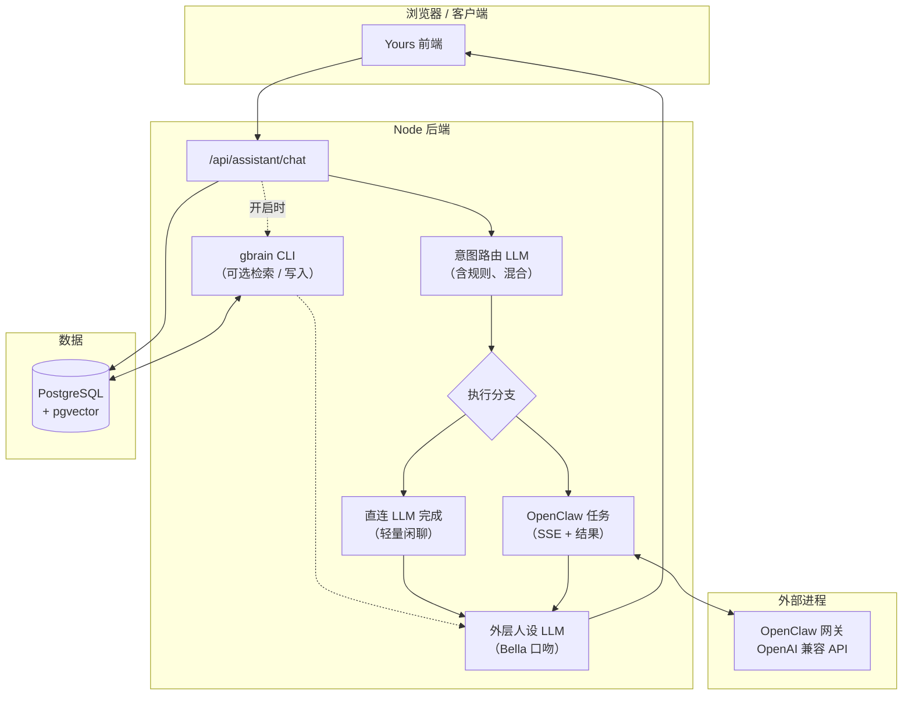

# Yours

英文说明见仓库根目录 [`README.md`](README.md)。

## Everlasting 与 Yours

Everlasting 是一个让人物在 AI 世界实现数字永生的尝试，其终极愿景是通过视频、图片、声音以及（记忆）数据合成技术，让数字人物像真人一样拥有感情、性格、爱好，并具备不断成长的能力。通过 Everlasting，每个人都可以真正地“重现”那些已经远去的人和场景，让珍贵的美好在赛博世界里永生。

Yours 是 Everlasting 的第一阶段产品，她是一个能够不断成长、善解人意的 AI 伴侣（目前仅开放 Bella 形象）。由于项目尚处于首次发布阶段，当前代码实现更侧重功能可用性，产品体验与视觉设计仍有待完善。详细的项目路线图与里程碑规划将在后续陆续公布。

---

## 架构概览

Yours 为单体仓库：**React + Vite** 前端、**Node** 后端、默认 **PostgreSQL**（启用伴侣记忆时需 **pgvector**），以及可选的 **OpenClaw** 网关承担重工具任务。对话链路按**意图先行、执行居中、人设收尾**组织，而不是单次扁平的大模型调用。

### 分层与职责

| 分层 | 作用 | 典型代码位置 |
|------|------|----------------|
| **意图（路由）LLM** | 将每轮输入分为闲聊、偏图像、偏任务等，并决定是否走 OpenClaw。支持纯 LLM、纯规则或**混合**（LLM 低置信时回落规则）。存在上传时强制任务路径与 OpenClaw。 | `bellaIntentClassifier.ts`，`assistant.ts` 内路由 |
| **执行层** | 轻量 `chat_only` 可走**同步**直连模型以降低延迟；文件、图像、视频或多步任务则发起 **OpenClaw 任务**（SSE 进度与轮询结果）。经 **OpenAI 兼容** HTTP 与网关通信。 | `assistant.ts`，`routes/assistant.ts` |
| **外层（人设）LLM** | **不会**把执行层原始日志直接给用户。在保留事实的前提下把执行结果改写成 Bella 口吻，并温和处理失败。系统人设与 SOUL 正文共同约束语气。 | `bellaComposer.ts`，`bellaOuterLlm.ts`，`bellaPersona.ts` |
| **OpenClaw** | 可选**执行器**，本仓库不内置。路由把工作派给网关后，由代理、工具与**技能**（文档、媒体、网页抽取等）完成。通过网关 URL、令牌与 agent id 等环境变量配置。 | 外部 CLI 与网关，详见 `docs/OPENCLAW_*.md` |
| **gbrain 与 Postgres** | **可选的长期伴侣记忆**。与 Bella 共用 **`DATABASE_URL`**；开启后由后端调用 **gbrain** CLI 做检索与写入。检索片段作为生文上下文注入（OpenClaw 路径还会带**写入范围**提示，避免跨用户污染）。这是**记忆子系统**，不替代意图层或人设层 LLM。 | `gbrainCli.ts`，`companionChatBridge.ts`，`docs/COMPANION_AUTH_GBRAIN.md` |

**会话状态**（短期上下文、上一轮意图等）在 `bellaState.ts` 中维护，与 gbrain 的长周期存储相互独立。

### 端到端对话流程（`POST /api/assistant/chat`）

1. 接收消息、历史、上传与模式。  
2. 加载短期会话记忆。  
3. 运行路由，得到 `intent`、`confidence`、`shouldUseOpenClaw`。  
4. 分支：同步文本，或 OpenClaw 任务（含下载与媒体等）。  
5. 若开启伴侣记忆，将 **gbrain** 检索结果并入本轮生文上下文。  
6. 调用**外层人设 LLM**生成最终对用户可见的回复。  
7. 返回 `reply`、`imageUrl`、`videoUrl`、`downloads`，异步任务场景下还可返回 `jobId`。

### 示意图



更细的实现说明见 [`docs/ARCHITECTURE_AND_REFACTOR.md`](docs/ARCHITECTURE_AND_REFACTOR.md)。

---

## 快速安装

**前置条件：** Node.js 与 npm、Docker（本地默认数据库）、Git。

1. **克隆**本仓库，在仓库根目录打开终端。

2. **安装依赖**（每个克隆做一次）：

   ```bash
   cd backend && npm install
   cd ../frontend && npm install
   ```

3. **后端环境**

   ```bash
   cp backend/.env.example backend/.env
   ```

   至少将 **`POSTGRES_PASSWORD`** 设为足够长的随机口令。除非使用外部数据库，否则可**不要**填写 **`DATABASE_URL`**，应用会根据 `POSTGRES_*` 自动拼连接串。

4. **数据库（在仓库根目录用 Docker）**

   ```bash
   npm run docker:db
   ```

5. **Prisma（在 `backend/` 下，首次正式跑之前执行）**

   ```bash
   cd backend
   npm run prisma:deploy
   npx prisma generate
   ```

6. **前端环境（可选）**  
   将需要的 `VITE_*` 变量写入 `frontend/.env` 或 `frontend/.env.local`（变量名见仓库根目录 `.env.example`）。

若计划使用 **gbrain**，**不要**只用官方 `postgres:16` 镜像而不带向量扩展，需要 **pgvector**（本仓库 Compose 已选用带 pgvector 能力的镜像）。细节见 [`docs/COMPANION_AUTH_GBRAIN.md`](docs/COMPANION_AUTH_GBRAIN.md)。

---

## 快速开始

1. **启动 Postgres**（若未运行）：在仓库根目录执行 `npm run docker:db`。

2. **后端**（终端 A）：

   ```bash
   cd backend
   npm run dev
   ```

   浏览器访问 **http://localhost:3001/health**，应看到含 `"status":"ok"` 的 JSON。

3. **前端**（终端 B）：

   ```bash
   cd frontend
   npm run dev
   ```

   浏览器打开 **http://localhost:5173** 进入 Bella 界面。

4. **首个账号**  
   用户表为空时可注册第一个账号。若已有用户仍需新注册，在 `backend/.env` 中设置 **`BELLA_ALLOW_REGISTER=1`**（详见伴侣记忆文档）。

5. **可选：OpenClaw 与 MiniMax（示例栈）**  
   按 [`docs/HANDS_ON_GUIDE.md`](docs/HANDS_ON_GUIDE.md) 配置 SOUL、网关与密钥。

6. **可选：gbrain 伴侣记忆**  
   在完成 Postgres 与 Prisma 后，对同一库执行 `gbrain init`，设置 **`GBRAIN_ENABLED=1`**，重启后端。完整步骤见 [`docs/COMPANION_AUTH_GBRAIN.md`](docs/COMPANION_AUTH_GBRAIN.md)。

**Windows 加 WSL 一键开发：** `scripts/dev-start.bat` 可在相关目录存在时启动网关、后端、前端及可选 Star Office。若自动探测失败，可复制 `scripts/dev-wsl.config.example.bat` 为 `scripts/dev-wsl.config.bat` 再改参数。依赖数据库的功能仍需你**自行**先完成 Prisma 迁移与 generate。

**生产构建**（仓库根目录）：

```bash
npm run build
```

依次执行后端 `tsc` 与前端 `tsc && vite build`。也可分别使用 `npm run build:backend` 或 `npm run build:frontend`。

---

## 文档索引

以下文档计划与 GitHub 仓库一并发布。表中为**文件名**及**文档主要内容**。

### 核心搭建与运维

| 文档 | 内容说明 |
|------|----------|
| [`docs/LOCAL_SETUP.md`](docs/LOCAL_SETUP.md) | 最小本地运行：仅 `POSTGRES_PASSWORD`、Docker 数据库、Prisma、开发服务。 |
| [`docs/COMPANION_AUTH_GBRAIN.md`](docs/COMPANION_AUTH_GBRAIN.md) | 自建：Postgres 与 pgvector、Bun、gbrain 初始化、环境变量、Prisma、登录、伴侣记忆开关、运维重置密码。 |
| [`docs/ENVIRONMENT_SETUP.md`](docs/ENVIRONMENT_SETUP.md) | 环境文件规范、根目录与 `VITE_*`、云上密钥、CI 建议。 |
| [`NODE_AND_LOCALHOST.md`](NODE_AND_LOCALHOST.md) | Node 自检与 localhost、端口访问问题排查。 |
| [`docs/WSL_MIGRATION.md`](docs/WSL_MIGRATION.md) | WSL 下使用说明。 |
| [`docs/GITHUB_RELEASE_CHECKLIST.md`](docs/GITHUB_RELEASE_CHECKLIST.md) | 公开发布前检查清单。 |

### 架构与产品行为

| 文档 | 内容说明 |
|------|----------|
| [`docs/ARCHITECTURE_AND_REFACTOR.md`](docs/ARCHITECTURE_AND_REFACTOR.md) | 当前 Bella 栈：路由、执行、人设；请求路径；模块地图；后续重构设想。 |
| [`docs/OPENCLAW_DECISION_FLOW.md`](docs/OPENCLAW_DECISION_FLOW.md) | OpenClaw 输出形态、技能映射、URL 路由与主意图分类器关系、SOUL 与网关说明。 |
| [`docs/BELLA_CAPABILITIES_AND_SKILLS.md`](docs/BELLA_CAPABILITIES_AND_SKILLS.md) | Bella 能力与技能面（概览）。 |
| [`docs/templates/Bella-SOUL.md`](docs/templates/Bella-SOUL.md) | OpenClaw 工作区 SOUL 模板（复制到 `~/.openclaw/workspace/SOUL.md`）。 |

### OpenClaw 网关与技能

| 文档 | 内容说明 |
|------|----------|
| [`docs/OPENCLAW_SETUP.md`](docs/OPENCLAW_SETUP.md) | 后端接入 OpenClaw 网关、HTTP 设置与 `backend/.env` 接线。 |
| [`docs/OPENCLAW_SKILLS_SETUP.md`](docs/OPENCLAW_SKILLS_SETUP.md) | 技能总索引与跨技能指引入口。 |
| [`docs/OPENCLAW_CHINA_WORLD_MODE.md`](docs/OPENCLAW_CHINA_WORLD_MODE.md) | OpenClaw 相关流程的中国区与海外区行为差异。 |
| [`docs/SKILL_CONVENTION_CHINA_WORLD.md`](docs/SKILL_CONVENTION_CHINA_WORLD.md) | 分区的技能编写约定。 |
| [`docs/OPENCLAW_PYTHON_VENV_UNIFIED.md`](docs/OPENCLAW_PYTHON_VENV_UNIFIED.md) | 技能侧 Python 虚拟环境统一约定。 |
| [`docs/OPENCLAW_SANDBOX_UPGRADE.md`](docs/OPENCLAW_SANDBOX_UPGRADE.md) | OpenClaw 沙箱升级说明。 |
| [`docs/OPENCLAW_WEB_FETCH_SSRF_AND_DNS.md`](docs/OPENCLAW_WEB_FETCH_SSRF_AND_DNS.md) | 网页抓取安全：SSRF 与 DNS 注意点。 |
| [`docs/WEATHER_SKILL_DIAGNOSTIC.md`](docs/WEATHER_SKILL_DIAGNOSTIC.md) | 天气技能排障。 |

**分技能安装指南**

| 文档 | 内容说明 |
|------|----------|
| [`docs/OPENCLAW_SKILL_PDF_SETUP.md`](docs/OPENCLAW_SKILL_PDF_SETUP.md) | PDF 技能。 |
| [`docs/OPENCLAW_SKILL_DOCX_SETUP.md`](docs/OPENCLAW_SKILL_DOCX_SETUP.md) | Word 与 DOCX 技能。 |
| [`docs/OPENCLAW_SKILL_PPTX_SETUP.md`](docs/OPENCLAW_SKILL_PPTX_SETUP.md) | PowerPoint 技能。 |
| [`docs/OPENCLAW_SKILL_XLSX_SETUP.md`](docs/OPENCLAW_SKILL_XLSX_SETUP.md) | Excel 技能。 |
| [`docs/OPENCLAW_SKILL_CANVAS_DESIGN_SETUP.md`](docs/OPENCLAW_SKILL_CANVAS_DESIGN_SETUP.md) | 画布与视觉设计技能。 |
| [`docs/OPENCLAW_SKILL_FRONTEND_DESIGN_SETUP.md`](docs/OPENCLAW_SKILL_FRONTEND_DESIGN_SETUP.md) | 前端与落地页类技能。 |
| [`docs/OPENCLAW_SKILL_MEDIA_IMAGE_SETUP.md`](docs/OPENCLAW_SKILL_MEDIA_IMAGE_SETUP.md) | 图像生成技能。 |
| [`docs/OPENCLAW_SKILL_MEDIA_VIDEO_SETUP.md`](docs/OPENCLAW_SKILL_MEDIA_VIDEO_SETUP.md) | 视频生成技能。 |
| [`docs/OPENCLAW_SKILL_WEB_TO_MARKDOWN_SETUP.md`](docs/OPENCLAW_SKILL_WEB_TO_MARKDOWN_SETUP.md) | 网页转 Markdown 技能。 |
| [`docs/OPENCLAW_SKILL_MARKITDOWN_SETUP.md`](docs/OPENCLAW_SKILL_MARKITDOWN_SETUP.md) | MarkItDown 基础安装。 |
| [`docs/OPENCLAW_SKILL_MARKITDOWN_INGEST_SETUP.md`](docs/OPENCLAW_SKILL_MARKITDOWN_INGEST_SETUP.md) | MarkItDown 摄取路径。 |
| [`docs/OPENCLAW_SKILL_MARKITDOWN_MULTIMODAL_SETUP.md`](docs/OPENCLAW_SKILL_MARKITDOWN_MULTIMODAL_SETUP.md) | MarkItDown 多模态安装。 |
| [`docs/OPENCLAW_SKILL_TAOBAO_SHOP_PRICE_SETUP.md`](docs/OPENCLAW_SKILL_TAOBAO_SHOP_PRICE_SETUP.md) | 淘宝店铺比价类技能。 |
| [`docs/OPENCLAW_SKILL_CHINA_E_COMMERCE_PRICE_COMPARISON_SKILLS_SETUP.md`](docs/OPENCLAW_SKILL_CHINA_E_COMMERCE_PRICE_COMPARISON_SKILLS_SETUP.md) | 国内电商比价相关技能。 |

### 提供商、部署与扩展

| 文档 | 内容说明 |
|------|----------|
| [`docs/BELLA_MINIMAX_SETUP.md`](docs/BELLA_MINIMAX_SETUP.md) | Bella 与 OpenClaw 侧的 MiniMax 提供方配置。 |
| [`docs/HANDS_ON_GUIDE.md`](docs/HANDS_ON_GUIDE.md) | 实操清单：MiniMax 密钥、SOUL、OpenClaw JSON、网关、curl 自测。 |
| [`docs/DEPLOY_AWS.md`](docs/DEPLOY_AWS.md) | AWS EC2、systemd 与 OpenClaw 网关一类部署。 |
| [`docs/AWS_APP_RUNNER_DEPLOY_BELLA.md`](docs/AWS_APP_RUNNER_DEPLOY_BELLA.md) | 面向 AWS App Runner 的部署说明。 |
| [`deploy/PUBLIC_DEPLOY.md`](deploy/PUBLIC_DEPLOY.md) | 公网推荐形态：网关仅本机回环、后端置于 TLS 之后、前端静态托管。 |
| [`docs/STAR_OFFICE_DEPLOY_AND_INTEGRATION.md`](docs/STAR_OFFICE_DEPLOY_AND_INTEGRATION.md) | Star Office 子模块部署与对接。 |
| [`docs/OPTIONAL_SUBMODULES.md`](docs/OPTIONAL_SUBMODULES.md) | 可选子模块模式（环境开关、路由、前端开关）。 |

### 模板

| 文档 | 内容说明 |
|------|----------|
| [`docs/templates/skill-china-world-example.md`](docs/templates/skill-china-world-example.md) | 分区技能文档示例。 |

---

## 主要入口文件（贡献者）

- `backend/src/routes/assistant.ts`：编排、任务、SSE、下载与媒体。  
- `backend/src/services/bellaIntentClassifier.ts`：意图分类。  
- `backend/src/services/assistant.ts`：模型提供方、OpenClaw、媒体辅助、gbrain 上下文挂钩。  
- `backend/src/services/bellaComposer.ts`：最终回复拼装。  
- `backend/src/services/bellaOuterLlm.ts`：外层人设 LLM。  
- `backend/src/services/bellaPersona.ts`：Bella 系统提示词。  
- `backend/src/services/bellaState.ts`：会话与意图记忆。

---

## OpenClaw 环境变量提示

网关不在本仓库内，需单独安装与配置。后端常见变量：**`OPENCLAW_GATEWAY_URL`**、**`OPENCLAW_GATEWAY_TOKEN`**（或兼容名）、**`OPENCLAW_AGENT_ID`**。
